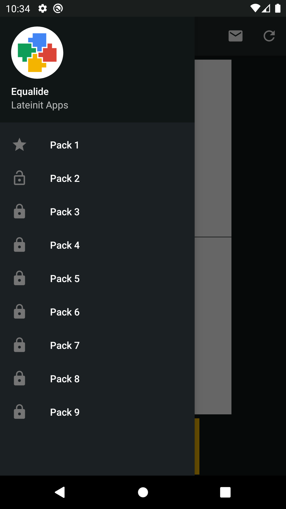
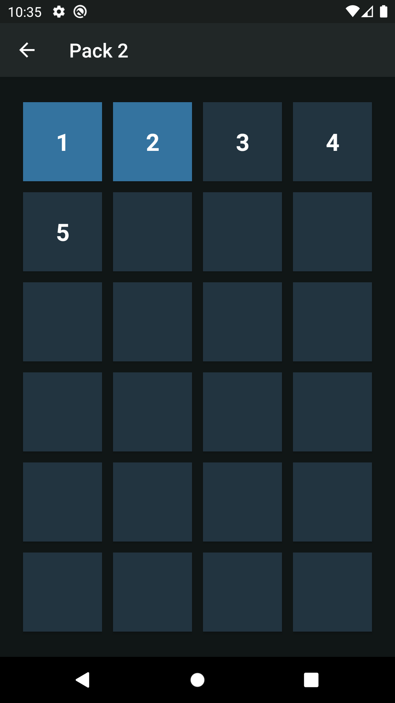
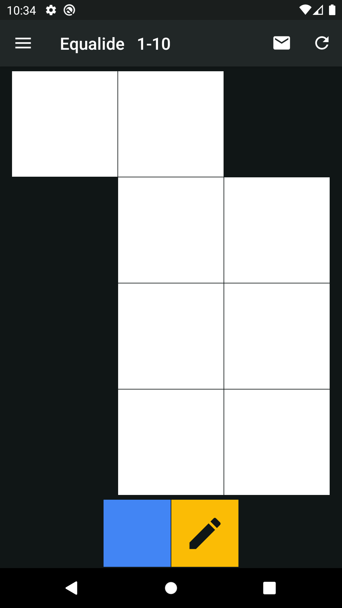
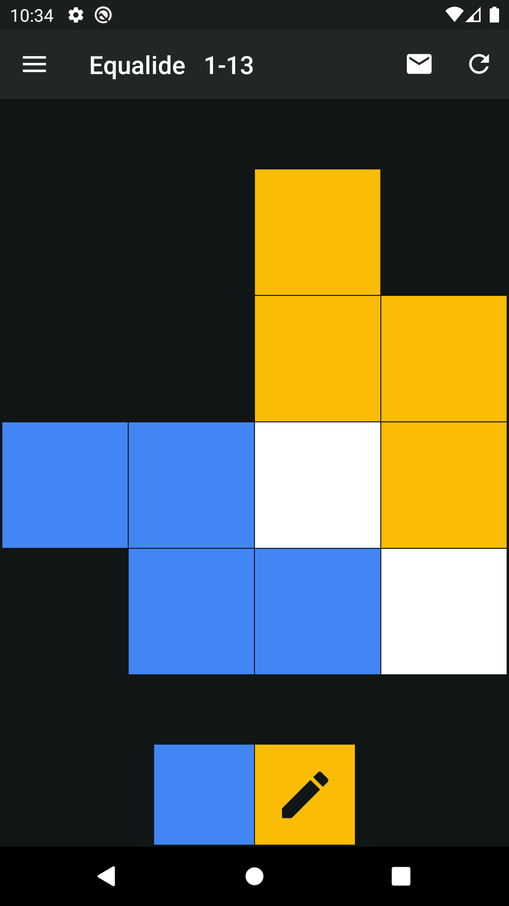
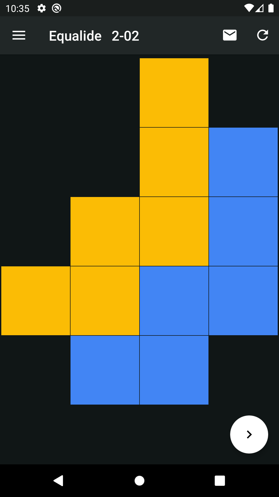

# Equalide

<a href="https://play.google.com/store/apps/details?id=com.lateinit.apps.equalide"></a>

Kotlin build of Equalide puzzle game.

Separate a figure into equal parts.
Can you beat all 216 levels?





## Internal tool

As part of the project a tool to view/create/edit/export puzzles was created at 
`internal-tool` branch. Support opening of .eqld files.

## Puzzle format to view/export

- One puzzle under another through an empty string
- The end of the line is uniform throughout the file
- File extension is .eqld

```txt
010
111
010

111
101
111
```

## Screenshots


