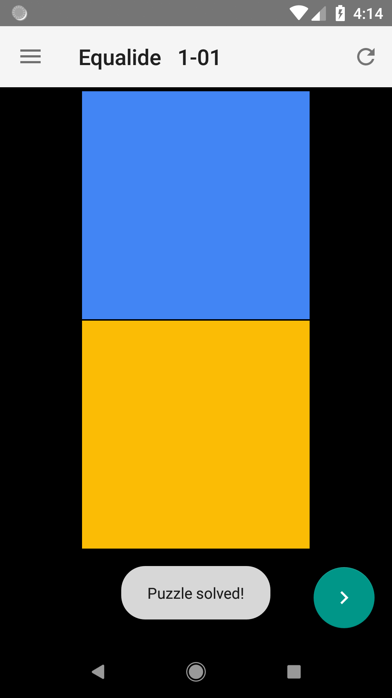
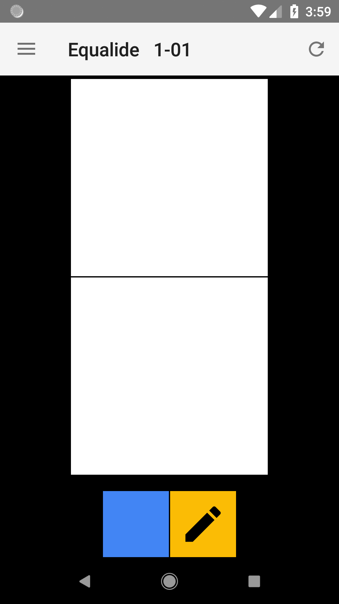

# Unsolved puzzle

## Action bar

- Hamburger button
- Title
- {pack}-{level}
- Refresh
  - tooltip "Refresh"

## Content view

- margin top action bar size
- margin left right bottom 1dp
- padding top 3dp

## Puzzle grid

- margin bottom 16dp
- border 0.5dp
- no border collapse

## Color palette

- color amount is same as element amount in puzzle
- fixed size = screen width / 5

# Solved puzzle

## Toast

- Puzzle solved!
- Pack solved!

## Floating action button

- color from material black theme
